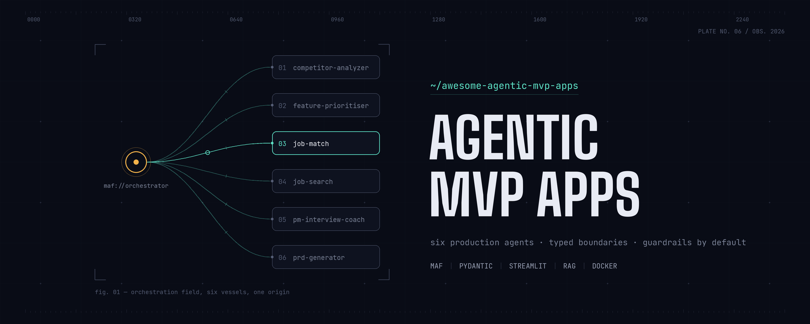

# Awesome Agentic MVP Apps



**Awesome Agentic MVP Apps** is a production-grade engineering reference architecture and open-source collection of AI agent applications, standalone micro-agent modules, system skills, and Vector RAG pipelines. Designed as an industry-standard boilerplate, each system component prioritizes modularity, strict type safety, defensive security, and containerized deployment.

---

## 🛠️ Engineering Architecture & Core Principles

Unlike minimal API wrappers or fragile LLM scripts, every component in this repository applies rigorous software engineering design patterns to agentic development:

- **Schema-Enforced Type Safety (Pydantic v2)**: Pydantic models govern every interface boundary—from user inputs and API transports to intermediate LLM reasoning structures and final document outputs. This ensures compile-time validation, automatic serialization, and protection against interface drift.
- **Defense-in-Depth Guardrails**: System architectures assume untrusted user inputs and third-party data. Security defense layers include heuristic prompt injection detection, input structural fencing, active script/markdown sanitization, and automated log secret redaction.
- **Robust Orchestration Patterns**: Application infrastructures leverage established orchestration engines such as the **Microsoft Agent Framework (MAF)** and implement decoupled asynchronous-to-synchronous event loop bridges to maintain thread safety and persistent HTTP connection pooling.
- **High-Performance RAG Pipelines**: Integrates state-of-the-art vector stores (Pinecone, Qdrant, FAISS) with local feature embedding engines (`bge-m3`, cross-encoder reranking, Reciprocal Rank Fusion) for context-grounded verification and low-latency retrieval.
- **One-Command Containerization**: Every full-stack application includes self-contained Dockerfiles and Docker Compose specifications for immediate reproduction across cloud or local container hosts.

---

## 🧰 Standardized Tech Stack

To prevent architectural drift and ensure reliable maintenance across all applications and micro-agents, Awesome Agentic MVP Apps employs a standardized, highly vetted engineering stack:

| Layer / Domain | Core Technology | Usage & Architectural Purpose |
| :--- | :--- | :--- |
| **Inference & Orchestration** | Groq SDK, OpenAI SDK, MAF | High-throughput low-latency LLM execution utilizing instruct models (`llama-3.3-70b-versatile`, `llama-3.1-8b-instant`, `gpt-4o-mini`), alongside Microsoft Agent Framework for conversational routing. |
| **Type Safety & Data Layer** | Pydantic v2, Pydantic Settings | Universal schema boundaries, structured JSON extraction, runtime constraint checking, and strict environment configuration management. |
| **Web Intelligence & Extraction** | Tavily API, `httpx` | Domain-whitelisted real-time search querying and clean full-page text extraction over persistent asynchronous HTTP connection pools. |
| **Vector Storage & RAG** | Mistral Embed, Pinecone, Qdrant | High-precision cosine similarity alignment (`mistral-embed`), embedding backstops, and cloud vector DB indexing for conversational RAG memory. |
| **Security & Guardrails** | Guardrails AI, Custom Algorithmic Guards | Defense-in-depth security including zero-fabrication provenance audits, prompt injection detection, input structural fencing, and automated PII log redaction. |
| **Document Processing** | `pypdf`, `fpdf2` | Resilient text parsing from unstructured PDF uploads and clean compilation of ATS-compliant structured PDF output documents. |
| **Application UI & Eventing** | Streamlit, Async Event Generators | Single-page responsive interfaces driven by decoupled async-to-sync generator loops that yield real-time streaming execution events. |
| **DevOps & Testing** | Docker, Docker Compose, Pytest, Ruff | One-command containerized builds optimized for ~1GB environments, comprehensive offline deterministic testing with network mocking, and automated code linting/formatting. |

---

## 📂 Repository Matrix

| Module / Directory | Type | Primary Technologies | Core Description | Link |
| :--- | :--- | :--- | :--- | :--- |
| **AI Competitor Analyzer** | MVP Application | Streamlit, Tavily, Pydantic, Docker | Market intelligence pipeline profiling competitors across 6 dimensions with zero-link fabrication guardrails. | [ai-competitor-analyzer](mvps/ai-competitor-analyzer) |
| **AI PM Interview Coach** | MVP Application | MAF, Streamlit, Pinecone, Qdrant, Docker | Multi-agent interview coaching system utilizing conversational RAG and rubric-enforced evaluation. | [ai-pm-interview-coach](mvps/ai-pm-interview-coach) |
| **AI PRD Generator MVP** | MVP Application | MAF, Streamlit, Pydantic, Docker | Autonomous specification generation platform featuring targeted section regeneration and dual operating scopes. | [ai-prd-generator](mvps/ai-prd-generator) |
| **AI Job Match** | MVP Application | Streamlit, Groq, mistral-embed, Guardrails-AI, Docker | Resume/job-description fit scoring with deterministic weighted arithmetic, plus resume rewriting under a mechanical no-fabrication guard. | [ai-job-match](mvps/ai-job-match) |
| **AI Job Search Assistant** | MVP Application | Streamlit, Tavily, Groq, mistral-embed, Docker | Whitelisted job-site search driven by the resume, returning postings ranked by an explainable two-tier match score. | [ai-job-search-assistant](mvps/ai-job-search-assistant) |
| **AI Agents** | Microservice Modules | Python, Pydantic, OpenAI SDK | Zero-overhead, decoupled agent modules designed for drop-in import into backend microservices or pipelines. | [ai-agents](ai-agents) |
| **AI Skills** | System Prompts & Skills | Markdown | Domain-adapted instructional frameworks and boundary security prompts for production agent architectures. | [ai-skills](ai-skills) |

---

## ⚡ 1. Full-Stack MVP Applications

### 📊 AI Competitor Analyzer
An autonomous market intelligence engine that combines deterministic web search workflows with schema-enforced LLM synthesis to produce auditable competitor briefs across six core business dimensions.
* **Architecture Highlights**: Deterministic search routing via Tavily API, URL exclusion during LLM inference to prevent hallucinated citations, entity resolution against corporate name collisions, and offline analytical fallbacks.
* **Quickstart Commands**:
  ```bash
  cd mvps/ai-competitor-analyzer
  cp .env.example .env && docker build -t ai-competitor-analyzer . && docker run --rm -p 8501:8501 --env-file .env ai-competitor-analyzer
  ```

---

### 🎙️ AI PM Interview Coach
An interactive simulation platform that deploys dual decoupled agent personas to challenge product management candidates and evaluate conversational transcripts against a strict 20-level rubric.
* **Architecture Highlights**: Stateless interviewer rebuilding per turn to eliminate persona drift, objective post-session evaluation without confirmation bias, multi-provider routing, and absolute in-memory session isolation.
* **Quickstart Commands**:
  ```bash
  cd mvps/ai-pm-interview-coach
  cp .env.example .env && docker build -t ai-pm-interview-coach . && docker run --rm -p 8502:8502 --env-file .env ai-pm-interview-coach
  ```

---

### 📄 AI PRD Generator
An advanced documentation pipeline that transforms concise feature or product concepts into exhaustive Product Requirement Documents (PRDs) formatted in clean Markdown.
* **Architecture Highlights**: Dual product/feature scope resolution, targeted per-section regeneration for token optimization and error recovery, and persistent background event-loop bridging.
* **Quickstart Commands**:
  ```bash
  cd mvps/ai-prd-generator
  cp .env.example .env && docker build -t ai-prd-generator . && docker run --rm -p 8501:8501 --env-file .env ai-prd-generator
  ```

---

### 🎯 AI Job Match
A resume-to-posting fit engine that scores a candidate against a specific job description and then rewrites the resume for it without inventing a single fact.
* **Architecture Highlights**: Deterministic weighted scoring computed in code from per-requirement verdicts (never asked of the model), embedding-based requirement matching that downgrades unsupported coverage claims, and a mechanical provenance guard that rejects any rewrite introducing a number, employer, tool, or contact detail absent from the original resume.
* **Quickstart Commands**:
  ```bash
  cd mvps/ai-job-match
  cp .env.example .env && docker build -t ai-job-match . && docker run --rm -p 8503:8503 --env-file .env ai-job-match
  ```

---

### 🔍 AI Job Search Assistant
A domain-restricted, LLM-driven job triage engine that searches whitelisted job sites based on an uploaded resume, returning postings evaluated with explainable two-tiered matching and algorithmic fact-checking.
* **Architecture Highlights**: Two-tiered evaluation decoupling shallow semantic snippet ranking from deep full-text requirement evaluation, domain-whitelisted search routing via Tavily API, algorithmic provenance checks against resume text quotes, and asymmetric prompt injection defenses.
* **Quickstart Commands**:
  ```bash
  cd mvps/ai-job-search-assistant
  cp .env.example .env && docker build -t ai-job-search-assistant . && docker run --rm -p 8504:8504 --env-file .env ai-job-search-assistant
  ```

---

## 🤖 2. AI Agents

Self-contained, pure Python agent modules stripped of web UI dependencies. Engineered for direct import into FastAPI endpoints, Celery workers, CLI utilities, and downstream backend architectures.

* **Supported Module Library**:
  * `Competitor Analyser Agent` — 6-dimension competitor profiling with live search & simulated offline fallback.
  * `PRD Generator Agent` — Structured specification drafting and outline expansion.
  * `PM Interview Coach Agent` — Interactive dialog generation and rubric-anchored evaluation.
  * `Job Match Agent` — Deterministic resume requirement fit evaluation and zero-fabrication ATS resume tailoring.
  * `Job Search Agent` — Resume profile extraction, targeted domain-whitelisted search query formulation, and two-tier triage scoring.
* **Quick Integration Pattern**:
  ```python
  from ai_agents.prd_ai_agent import PRDAgent, PRDInput

  agent = PRDAgent(model="gpt-4o-mini", provider="openai")
  prd = agent.generate(PRDInput(product_name="Smart Alerts", problem_statement="DevOps alert fatigue remediation."))
  print(prd.to_markdown())
  ```

---

## 🧠 3. AI Skills & System Prompts

Structured system instructions and domain skill sets designed to power reliable reasoning behaviors across autonomous LLM platforms (ChatGPT, Claude, Cursor, custom runtime engines).

* **Featured Skills**:
  * [Competitor Analyst](ai-skills/competitor-analyst.md) — Six-section intelligence briefing with explicit missing data abstention rules.
  * [PRD Generator](ai-skills/prd-generator.md) — Outline generation and word-budgeted sectional document expansions.
  * [PM Interview Coach](ai-skills/pm-interview-coach.md) — Strict interviewer question frameworks and evidence-quoted evaluation criteria.
  * [Resume Job Fit](ai-skills/resume-job-fit.md) — Requirement extraction and factual evidence mapping between resumes and single postings without numerical score hallucinations.
  * [Resume-Driven Job Search](ai-skills/resume-driven-job-search.md) — Two-tiered search ranking and full-posting requirement grading with strict quote provenance.
  * [Feature Prioritisation](ai-skills/feature-prioritisation.md) — RICE and ICE estimation over one shared factor set, with the arithmetic held outside the model.
  * [Untrusted Input Guardrail](ai-skills/untrusted-input-guardrail.md) — Universal boundary fencing template for processing untrusted third-party text.

---

## 🤝 Contribution & Standards

This project operates as an extensible engineering reference. When contributing new components:
1. Ensure all system boundaries are typed with **Pydantic v2**.
2. Implement structural guardrails (prompt fencing, input validation, output sanitization).
3. Include comprehensive automated test coverage (`pytest`) and code formatting (`ruff`).
4. Maintain decoupled application logic (`app/` must remain completely agnostic of display/UI libraries).

---

## 📄 License

Licensed under the [Apache-2.0 License](LICENSE).
